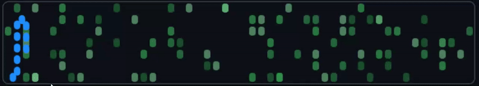

# 👋 Hello, I'm Ollie Fawkes

I'm a computer science curretnly in 2nd year at UEA, i am working on a few projects and trying to broaden my programming scope;

 

---

## 🛠️ Languages & Tools

  
  
  
  
  
  
  

---

## 📊 GitHub Stats

   

---

## 🚀 Featured Projects

  
  
  

---

## 💬 About Me

