# 👋 Hello, I'm Ollie Fawkes

I'm a computer science curretnly in 2nd year at UEA, i am working on a few projects and trying to broaden my programming scope;

 

---

## 🛠️ Languages & Tools

  
  
  
  
  
  
  

---

## 📊 GitHub Stats

   

---

## 🚀 Featured Projects

  <a href="https://github.com/fawkeso16/health-tracker" style="
      display: inline-block;
      padding: 10px 20px;
      margin: 5px;
      font-weight: bold;
      color: white;
      background: linear-gradient(45deg, #61dafb, #21a1f1);
      border: none;
      border-radius: 12px;
      text-decoration: none;
      transition: transform 0.2s;
  " onmouseover="this.style.transform='scale(1.1)'" onmouseout="this.style.transform='scale(1)'">
    Health Tracker
  </a>

  <a href="https://github.com/fawkeso16/drone-simulator" style="
      display: inline-block;
      padding: 10px 20px;
      margin: 5px;
      font-weight: bold;
      color: white;
      background: linear-gradient(45deg, #f05454, #d90429);
      border: none;
      border-radius: 12px;
      text-decoration: none;
      transition: transform 0.2s;
  " onmouseover="this.style.transform='scale(1.1)'" onmouseout="this.style.transform='scale(1)'">
    Drone Simulator
  </a>

  <a href="https://github.com/fawkeso16/video-game-search-engine" style="
      display: inline-block;
      padding: 10px 20px;
      margin: 5px;
      font-weight: bold;
      color: white;
      background: linear-gradient(45deg, #ffb347, #ffcc33);
      border: none;
      border-radius: 12px;
      text-decoration: none;
      transition: transform 0.2s;
  " onmouseover="this.style.transform='scale(1.1)'" onmouseout="this.style.transform='scale(1)'">
    Video Game Search Engine
  </a>

---

## 💬 About Me

